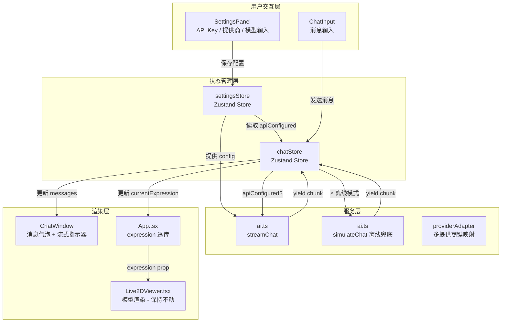

# AI 接口接入完整方案

## 一、当前架构现状诊断

当前数据链路中**已经工作**和**缺失**的部分：

```
✅ ChatInput.tsx          →  用户输入正常采集
✅ chatStore.sendMessage  →  消息存储 + 流式消费正常
✅ ai.ts streamChat       →  符合 OpenAI /v1/chat/completions 协议
✅ ai.ts simulateChat     →  离线兜底模式正常
⚠️ defaultAIConfig        →  apiKey 硬编码为空字符串，等同于未配置
❌ 无 API Key 输入入口    →  用户无法填入自己的 Key
❌ 无提供商选择           →  仅支持 OpenAI 格式，无 DeepSeek/通义千问等
❌ 无设置持久化           →  刷新即丢失配置
❌ chatStore              →  streamChat chunk 携带 expression，但 Live2DViewer 未消费
✅ Live2DViewer.tsx       →  渲染正常，保持不动
```

**核心结论**：AI 接入的"管道"已经铺好（`streamChat` + `chatStore`），缺少的是**上游水源**（API Key 配置入口 + 提供商管理）和**下游水龙头**（expression 消费接入 Live2DViewer）。

---

## 二、技术栈

| 层 | 技术选型 | 说明 |
|---|---------|------|
| **运行时** | Vite 8 + React 19 + TypeScript 6 | 已就绪 |
| **状态管理** | Zustand 5 | 已就绪，新增 `settingsStore` |
| **AI 协议** | OpenAI `/v1/chat/completions` 兼容 | 已就绪，`ai.ts` 无需大改 |
| **多提供商** | 纯配置映射表 + Provider Adapter 模式 | 不引入第三方 SDK |
| **配置持久化** | `localStorage` | 无后端，前端直存 |
| **UI 组件** | Tailwind CSS 4 + Framer Motion 12 | 已就绪 |
| **安全策略** | `.env` + Vite `VITE_` 前缀注入 | 构建时注入默认值 |

---

## 三、整体数据流架构



---

## 四、逐文件修改清单（Live2DViewer.tsx 不动）

建议新建文件和修改文件总计 **8 个文件**：

| # | 文件 | 操作 | 说明 |
|---|------|------|------|
| 1 | `.env.example` | **新建** | 环境变量模板 |
| 2 | `src/types/index.ts` | **修改** | AIConfig 扩展 + 新增类型 |
| 3 | `src/services/providers.ts` | **新建** | 多提供商配置映射表 |
| 4 | `src/services/ai.ts` | **修改** | 增强错误处理 + 重试 + Token 估算 |
| 5 | `src/store/settingsStore.ts` | **新建** | API 配置持久化 Zustand Store |
| 6 | `src/store/chatStore.ts` | **修改** | 读取 settingsStore 替代硬编码配置 |
| 7 | `src/components/settings/SettingsPanel.tsx` | **新建** | API 配置面板 UI |
| 8 | `src/App.tsx` | **修改** | 集成 SettingsPanel + expression 链路 |

---

## 五、详细实现方案

### 5.1 新建 `.env.example` — 环境变量模板

```bash
# .env.example（复制为 .env 使用，不要提交到 Git）
# AI 服务默认配置
VITE_AI_BASE_URL=https://api.openai.com/v1
VITE_AI_MODEL=gpt-4o-mini
VITE_AI_API_KEY=

# 备选提供商示例：
# VITE_AI_BASE_URL=https://api.deepseek.com/v1
# VITE_AI_MODEL=deepseek-chat
```

> **安全提示**：Demo 阶段 API Key 存储在 `localStorage`。生产环境必须通过后端代理转发，禁止前端直传 Key。

---

### 5.2 扩展 `src/types/index.ts` — 新增类型定义

```typescript
// ===== 在现有类型基础上新增 =====

// 多提供商定义
export interface AIProvider {
  id: string;           // 'openai' | 'deepseek' | 'qwen' | 'custom'
  name: string;         // 'OpenAI' | 'DeepSeek' | '通义千问' | '自定义'
  baseUrl: string;      // API 端点
  models: string[];     // 该提供商支持的模型列表
  defaultModel: string;
  requiresApiKey: boolean;
}

// 扩展 AIConfig（原类型增加字段）
export interface AIConfig {
  apiKey: string;
  baseUrl: string;
  model: string;
  systemPrompt: string;
  provider: string;          // 新增：当前提供商 ID
  temperature: number;       // 新增：温度参数
  maxTokens: number;         // 新增：最大 Token
  maxContextMessages: number;// 新增：上下文窗口消息数
}

// 设置 Store 类型
export interface SettingsState {
  config: AIConfig;
  isConfigured: boolean;
  updateConfig: (partial: Partial<AIConfig>) => void;
  resetConfig: () => void;
}
```

---

### 5.3 新建 `src/services/providers.ts` — 多提供商配置

```typescript
import type { AIProvider } from '../types';

// ===== 预置 AI 提供商 =====
export const aiProviders: AIProvider[] = [
  {
    id: 'openai',
    name: 'OpenAI',
    baseUrl: 'https://api.openai.com/v1',
    models: ['gpt-4o-mini', 'gpt-4o', 'gpt-4-turbo', 'gpt-3.5-turbo'],
    defaultModel: 'gpt-4o-mini',
    requiresApiKey: true,
  },
  {
    id: 'deepseek',
    name: 'DeepSeek',
    baseUrl: 'https://api.deepseek.com/v1',
    models: ['deepseek-chat', 'deepseek-reasoner'],
    defaultModel: 'deepseek-chat',
    requiresApiKey: true,
  },
  {
    id: 'qwen',
    name: '通义千问',
    baseUrl: 'https://dashscope.aliyuncs.com/compatible-mode/v1',
    models: ['qwen-turbo', 'qwen-plus', 'qwen-max'],
    defaultModel: 'qwen-plus',
    requiresApiKey: true,
  },
  {
    id: 'custom',
    name: '自定义',
    baseUrl: '',
    models: [],
    defaultModel: '',
    requiresApiKey: false,
  },
];

// 根据 ID 查找提供商
export function getProvider(id: string): AIProvider | undefined {
  return aiProviders.find((p) => p.id === id);
}
```

---

### 5.4 增强 `src/services/ai.ts` — 错误处理 + 重试 + Token 管理

```typescript
import type { AIConfig, ChatMessage } from '../types';
import { inferExpression } from '../data/expressions';

// ===== Token 估算（简易版，中英文混合估算）=====
function estimateTokens(text: string): number {
  // 中文：~1.5 字符/token，英文：~4 字符/token
  const chineseChars = (text.match(/[\u4e00-\u9fff]/g) || []).length;
  const otherChars = text.length - chineseChars;
  return Math.ceil(chineseChars / 1.5 + otherChars / 4);
}

// 截断消息历史，保证不超出上下文窗口
function truncateMessages(
  messages: ChatMessage[],
  systemPrompt: string,
  maxTokens: number,
  maxMessages: number,
): { role: string; content: string }[] {
  const systemTokens = estimateTokens(systemPrompt);
  let budget = maxTokens - systemTokens - 300; // 预留 300 给回复

  const result: { role: string; content: string }[] = [
    { role: 'system', content: systemPrompt },
  ];

  // 从最近的开始取，保证最近对话在上下文内
  const recent = messages
    .filter((m) => m.role !== 'system')
    .slice(-maxMessages);

  for (let i = recent.length - 1; i >= 0; i--) {
    const tokens = estimateTokens(recent[i].content);
    if (budget - tokens < 0) break; // Token 预算耗尽
    budget -= tokens;
  }

  // 正序插入
  const startIdx = recent.length - Math.min(recent.length, maxMessages);
  for (let i = startIdx; i < recent.length; i++) {
    result.push({
      role: recent[i].role as 'user' | 'assistant',
      content: recent[i].content,
    });
  }

  return result;
}

// ===== 指数退避重试 =====
async function fetchWithRetry(
  url: string,
  options: RequestInit,
  maxRetries = 2,
): Promise<Response> {
  for (let attempt = 0; attempt <= maxRetries; attempt++) {
    try {
      const response = await fetch(url, options);
      
      // 429 / 5xx 重试，4xx（非429）不重试
      if (response.ok) return response;
      
      if (response.status === 429 || response.status >= 500) {
        if (attempt < maxRetries) {
          const delay = Math.min(1000 * 2 ** attempt, 8000);
          console.warn(`[AI] 重试第 ${attempt + 1} 次，等待 ${delay}ms...`);
          await new Promise((r) => setTimeout(r, delay));
          continue;
        }
      }
      
      return response; // 非可重试错误，直接返回
    } catch (err) {
      if (attempt < maxRetries) {
        const delay = Math.min(1000 * 2 ** attempt, 8000);
        await new Promise((r) => setTimeout(r, delay));
        continue;
      }
      throw err;
    }
  }
  throw new Error('请求失败：已达最大重试次数');
}

// ===== 流式 AI 对话（增强版）=====
export async function* streamChat(
  messages: ChatMessage[],
  config: AIConfig,
): AsyncGenerator<{ text: string; expression: string }> {
  const apiMessages = truncateMessages(
    messages,
    config.systemPrompt,
    config.maxTokens || 4096,
    config.maxContextMessages || 20,
  );

  const response = await fetchWithRetry(
    `${config.baseUrl}/chat/completions`,
    {
      method: 'POST',
      headers: {
        'Content-Type': 'application/json',
        Authorization: `Bearer ${config.apiKey}`,
      },
      body: JSON.stringify({
        model: config.model,
        messages: apiMessages,
        stream: true,
        max_tokens: 300,
        temperature: config.temperature ?? 0.8,
      }),
    },
  );

  if (!response.ok) {
    const errorText = await response.text();
    let userMessage = 'AI 服务请求失败';
    
    if (response.status === 401) {
      userMessage = 'API Key 无效，请检查设置中的密钥是否正确';
    } else if (response.status === 429) {
      userMessage = '请求过于频繁，请稍后再试';
    } else if (response.status === 403) {
      userMessage = 'API Key 无权限，请检查账户余额或权限';
    } else {
      userMessage = `AI API 错误 (${response.status})`;
    }
    
    throw new Error(userMessage);
  }

  const reader = response.body?.getReader();
  if (!reader) throw new Error('无法读取响应流');

  const decoder = new TextDecoder();
  let fullText = '';
  let buffer = '';

  while (true) {
    const { done, value } = await reader.read();
    if (done) break;

    buffer += decoder.decode(value, { stream: true });
    const lines = buffer.split('\n');
    buffer = lines.pop() || '';

    for (const line of lines) {
      const trimmed = line.trim();
      if (!trimmed || !trimmed.startsWith('data: ')) continue;

      const dataStr = trimmed.slice(6);
      if (dataStr === '[DONE]') continue;

      try {
        const data = JSON.parse(dataStr);
        const content = data.choices?.[0]?.delta?.content;
        if (content) {
          fullText += content;
          yield { text: content, expression: inferExpression(fullText) };
        }
      } catch {
        // 跳过解析错误的行
      }
    }
  }
}
```

---

### 5.5 新建 `src/store/settingsStore.ts` — 配置持久化

```typescript
import { create } from 'zustand';
import type { AIConfig } from '../types';

// ===== 默认配置 =====
const DEFAULT_CONFIG: AIConfig = {
  apiKey: import.meta.env.VITE_AI_API_KEY || '',
  baseUrl: import.meta.env.VITE_AI_BASE_URL || 'https://api.openai.com/v1',
  model: import.meta.env.VITE_AI_MODEL || 'gpt-4o-mini',
  systemPrompt: `你是 HK416，一名精锐的战术人形。你沉着冷静，话不多但句句有力。
- 语气简洁干练，带一点傲娇但不会太冰冷
- 称呼对方为"指挥官"
- 回复保持简短（1-2句话）
- 偶尔流露出对指挥官的关心
- 如果对方遇到困难，会理性分析并给出建议
- 战斗之外也会有一些小女生的柔软一面`,
  provider: 'openai',
  temperature: 0.8,
  maxTokens: 4096,
  maxContextMessages: 20,
};

// 从 localStorage 恢复
function loadConfig(): AIConfig {
  try {
    const saved = localStorage.getItem('mindchat_ai_config');
    if (saved) return { ...DEFAULT_CONFIG, ...JSON.parse(saved) };
  } catch {}
  return { ...DEFAULT_CONFIG };
}

// 持久化到 localStorage
function saveConfig(config: AIConfig) {
  try {
    localStorage.setItem('mindchat_ai_config', JSON.stringify(config));
  } catch {}
}

interface SettingsStore {
  config: AIConfig;
  isConfigured: boolean;
  updateConfig: (partial: Partial<AIConfig>) => void;
  resetConfig: () => void;
}

export const useSettingsStore = create<SettingsStore>((set) => ({
  config: loadConfig(),
  isConfigured: loadConfig().apiKey.length > 0,

  updateConfig: (partial) =>
    set((state) => {
      const newConfig = { ...state.config, ...partial };
      saveConfig(newConfig);
      return {
        config: newConfig,
        isConfigured: newConfig.apiKey.length > 0,
      };
    }),

  resetConfig: () => {
    saveConfig(DEFAULT_CONFIG);
    set({ config: { ...DEFAULT_CONFIG }, isConfigured: false });
  },
}));
```

---

### 5.6 修改 `src/store/chatStore.ts` — 接入 settingsStore

```typescript
import { create } from 'zustand';
import type { ChatMessage, ExpressionType } from '../types';
import { streamChat, simulateChat } from '../services/ai';
import { useSettingsStore } from './settingsStore';

// ... uid() 保持不变 ...

export const useChatStore = create<ChatStore>((set, get) => ({
  messages: [],
  isStreaming: false,
  currentExpression: 'neutral' as ExpressionType,
  
  // 关键变化：从 settingsStore 实时读取，而非硬编码
  get apiConfigured() {
    return useSettingsStore.getState().isConfigured;
  },

  addMessage: (role, content, expression) => {
    // ... 保持不变 ...
  },

  sendMessage: async (content: string) => {
    const { addMessage, messages } = get();
    const settings = useSettingsStore.getState();

    addMessage('user', content);

    const aiMsgId = uid();
    const aiMsg: ChatMessage = {
      id: aiMsgId,
      role: 'assistant',
      content: '',
      timestamp: Date.now(),
      expression: 'neutral',
      isTyping: true,
    };
    set((s) => ({
      messages: [...s.messages, aiMsg],
      isStreaming: true,
    }));

    try {
      let lastExpr = 'neutral';

      // 关键变化：用 settings.config 替代 defaultAIConfig
      if (settings.isConfigured) {
        const allMsgs = [...messages, { id: uid(), role: 'user' as const, content, timestamp: Date.now() }];
        const stream = streamChat(allMsgs, settings.config);

        for await (const chunk of stream) {
          lastExpr = chunk.expression;
          set((s) => {
            const msgs = [...s.messages];
            const lastMsg = msgs[msgs.length - 1];
            if (lastMsg && lastMsg.id === aiMsgId) {
              lastMsg.content += chunk.text;
              lastMsg.expression = chunk.expression;
              lastMsg.isTyping = false;
            }
            return { messages: msgs, currentExpression: chunk.expression as ExpressionType };
          });
        }
      } else {
        // 离线模拟模式（保持不变）
        const stream = simulateChat(content);
        for await (const chunk of stream) {
          // ... 保持不变 ...
        }
      }

      set((s) => ({ isStreaming: false, currentExpression: lastExpr as ExpressionType }));
    } catch (err) {
      set((s) => {
        const msgs = [...s.messages];
        const lastMsg = msgs[msgs.length - 1];
        if (lastMsg && lastMsg.id === aiMsgId) {
          lastMsg.content = `❌ ${err instanceof Error ? err.message : '未知错误'}`;
          lastMsg.isTyping = false;
          lastMsg.expression = 'sad';
        }
        return { messages: msgs, isStreaming: false, currentExpression: 'sad' as ExpressionType };
      });
    }
  },

  setExpression: (expr) => set({ currentExpression: expr }),
  clearMessages: () => set({ messages: [], currentExpression: 'neutral' }),
}));
```

---

### 5.7 新建 `src/components/settings/SettingsPanel.tsx` — API 配置 UI

```typescript
import React, { useState } from 'react';
import { motion, AnimatePresence } from 'framer-motion';
import { useSettingsStore } from '../../store/settingsStore';
import { aiProviders, getProvider } from '../../services/providers';

const SettingsPanel: React.FC = () => {
  const [open, setOpen] = useState(false);
  const { config, isConfigured, updateConfig, resetConfig } = useSettingsStore();
  
  const currentProvider = getProvider(config.provider);

  return (
    <>
      {/* 触发按钮 */}
      <button
        onClick={() => setOpen(!open)}
        className="fixed top-4 right-4 z-50 px-3 py-2 rounded-lg text-xs transition-all"
        style={{
          background: isConfigured 
            ? 'rgba(0,212,255,0.15)' 
            : 'rgba(255,107,157,0.15)',
          border: `1px solid ${isConfigured ? 'rgba(0,212,255,0.3)' : 'rgba(255,107,157,0.3)'}`,
          color: isConfigured ? '#00D4FF' : '#FF6B9D',
        }}
      >
        {isConfigured ? '⚡ AI 已连接' : '⚠ 未配置 AI'}
      </button>

      {/* 面板 */}
      <AnimatePresence>
        {open && (
          <motion.div
            initial={{ opacity: 0, x: 20 }}
            animate={{ opacity: 1, x: 0 }}
            exit={{ opacity: 0, x: 20 }}
            className="fixed top-14 right-4 z-50 w-80 p-5 rounded-xl backdrop-blur-xl"
            style={{
              background: 'rgba(10,10,26,0.95)',
              border: '1px solid rgba(255,255,255,0.1)',
            }}
          >
            <h3 className="text-white/80 text-sm font-medium mb-4">AI 服务配置</h3>

            {/* 提供商选择 */}
            <label className="text-white/40 text-xs mb-1 block">提供商</label>
            <select
              value={config.provider}
              onChange={(e) => {
                const p = getProvider(e.target.value);
                if (p) {
                  updateConfig({
                    provider: p.id,
                    baseUrl: p.baseUrl,
                    model: p.defaultModel,
                  });
                }
              }}
              className="w-full mb-3 px-3 py-2 rounded-lg text-sm text-white/80 outline-none"
              style={{ background: 'rgba(255,255,255,0.05)', border: '1px solid rgba(255,255,255,0.1)' }}
            >
              {aiProviders.map((p) => (
                <option key={p.id} value={p.id} className="bg-[#0A0A1A]">
                  {p.name}
                </option>
              ))}
            </select>

            {/* API Key */}
            <label className="text-white/40 text-xs mb-1 block">API Key</label>
            <input
              type="password"
              value={config.apiKey}
              onChange={(e) => updateConfig({ apiKey: e.target.value })}
              placeholder="sk-..."
              className="w-full mb-3 px-3 py-2 rounded-lg text-sm text-white/80 outline-none"
              style={{ background: 'rgba(255,255,255,0.05)', border: '1px solid rgba(255,255,255,0.1)' }}
            />

            {/* 模型 */}
            <label className="text-white/40 text-xs mb-1 block">模型</label>
            <input
              type="text"
              value={config.model}
              onChange={(e) => updateConfig({ model: e.target.value })}
              placeholder="gpt-4o-mini"
              className="w-full mb-3 px-3 py-2 rounded-lg text-sm text-white/80 outline-none"
              style={{ background: 'rgba(255,255,255,0.05)', border: '1px solid rgba(255,255,255,0.1)' }}
            />

            {/* 自定义 Base URL */}
            {config.provider === 'custom' && (
              <>
                <label className="text-white/40 text-xs mb-1 block">API 端点</label>
                <input
                  type="text"
                  value={config.baseUrl}
                  onChange={(e) => updateConfig({ baseUrl: e.target.value })}
                  placeholder="https://api.openai.com/v1"
                  className="w-full mb-3 px-3 py-2 rounded-lg text-sm text-white/80 outline-none"
                  style={{ background: 'rgba(255,255,255,0.05)', border: '1px solid rgba(255,255,255,0.1)' }}
                />
              </>
            )}

            {/* 操作按钮 */}
            <div className="flex gap-2 mt-4">
              <button
                onClick={() => setOpen(false)}
                className="flex-1 py-2 rounded-lg text-sm text-white/40 transition-colors hover:text-white/60"
                style={{ background: 'rgba(255,255,255,0.05)' }}
              >
                关闭
              </button>
              <button
                onClick={resetConfig}
                className="flex-1 py-2 rounded-lg text-sm transition-colors"
                style={{ 
                  background: 'rgba(255,71,87,0.15)', 
                  color: '#FF6B9D',
                }}
              >
                重置
              </button>
            </div>
          </motion.div>
        )}
      </AnimatePresence>
    </>
  );
};

export default SettingsPanel;
```

---

### 5.8 修改 `src/App.tsx` — 集成 SettingsPanel

```typescript
import React, { useState } from 'react';
import Live2DViewer from './components/Live2D/Live2DViewer';
import ChatWindow from './components/chat/ChatWindow';
import SceneBackground from './components/scene/SceneBackground';
import CharacterOverlay from './components/scene/CharacterOverlay';
import ProjectCredit from './components/scene/ProjectCredit';
import SettingsPanel from './components/settings/SettingsPanel';  // 新增
import { useChatStore } from './store/chatStore';
import { characterPresets } from './data/characters';
import { expressionList } from './data/expressions';

function App() {
  const { currentExpression } = useChatStore();
  const [selectedChar] = useState(0);

  const character = characterPresets[selectedChar];
  const currentExprConfig = expressionList.find((e) => e.id === currentExpression);

  return (
    <div className="relative w-screen h-screen flex flex-col overflow-hidden"
      style={{ background: '#0A0A1A' }}>

      {/* ===== 右上角：AI 设置面板（新增）===== */}
      <SettingsPanel />

      {/* ===== 上层：场景 + Live2D 角色展示区 (75vh) ===== */}
      <div className="relative w-full overflow-hidden" style={{ height: '75vh' }}>
        <SceneBackground />
        <Live2DViewer
          key={character.modelUrl}
          modelUrl={character.modelUrl}
          expression={currentExpression}
        />
        <CharacterOverlay
          name={character.name}
          status={currentExprConfig?.labelCn || '平静'}
        />
        <ProjectCredit />
      </div>

      {/* ===== 下层：通栏对话交互面板 (25vh) ===== */}
      <div className="glass-panel w-full z-30 flex flex-col" style={{ height: '25vh' }}>
        <ChatWindow />
      </div>
    </div>
  );
}

export default App;
```

---

## 六、实施路线图

| Step | 内容 | 涉及文件 | 预计耗时 |
|------|------|---------|---------|
| **S1** | 新建 `.env.example` | 1 个新建 | 2 min |
| **S2** | 扩展 `types/index.ts` | 1 个修改 | 5 min |
| **S3** | 新建 `services/providers.ts` | 1 个新建 | 5 min |
| **S4** | 增强 `services/ai.ts` | 1 个修改 | 15 min |
| **S5** | 新建 `store/settingsStore.ts` | 1 个新建 | 10 min |
| **S6** | 修改 `store/chatStore.ts` | 1 个修改 | 8 min |
| **S7** | 新建 `components/settings/SettingsPanel.tsx` | 1 个新建 | 15 min |
| **S8** | 修改 `App.tsx` 集成设置面板 | 1 个修改 | 2 min |
| **合计** | | **3 个新建 + 4 个修改** | **~60 min** |

---

## 七、验证测试清单

| 测试用例 | 预期结果 |
|---------|---------|
| 打开设置面板 | 面板从右侧滑入，显示提供商/Key/模型输入 |
| 选择 DeepSeek 提供商 | baseUrl 和 model 自动切换到 DeepSeek 预设值 |
| 填入有效 API Key | 关闭面板后，右上角按钮显示 "⚡ AI 已连接" |
| 不填 Key 发送消息 | 使用离线 simulateChat 模式回复 |
| 填入错误 Key 发送消息 | 显示 "API Key 无效" 错误提示 |
| 刷新浏览器 | 上次配置的 API Key 仍在，无需重新输入 |
| AI 流式回复中 | ChatWindow 逐字显示 + 情绪标签实时变化 |
| 回复 "哈哈" | currentExpression 变为 happy, 模型表情切换 |
| Live2D 模型渲染 | 模型正常显示，无 regression |

---

## 八、不修改 Live2DViewer.tsx 的保证

整个方案中，`Live2DViewer.tsx` **零改动**。链路是：

```
chatStore.currentExpression (变化)
  → App.tsx 读取并透传 expression prop
    → Live2DViewer 接收 expression prop（现有 props 接口不变）
```

当前 `Live2DViewer.tsx` 接收了 `expression` prop，后续在"动作系统"环节再实现表达消费逻辑。

---

## 九、风险评估

| 风险 | 缓解措施 |
|------|---------|
| API Key 前端暴露 | Demo 阶段可接受；生产需通过 Vite proxy 或后端 BFF 转发 |
| localStorage 被 XSS 读取 | 添加 CSP 头 + `httpOnly` cookie 替代方案（远期） |
| 跨域问题 | CORS 由各 AI 提供商处理，OpenAI/DeepSeek 均支持浏览器直连 |
| 流式 SSE 解析不完整 | `ai.ts` 中 buffer 机制已处理不完整 chunk |
