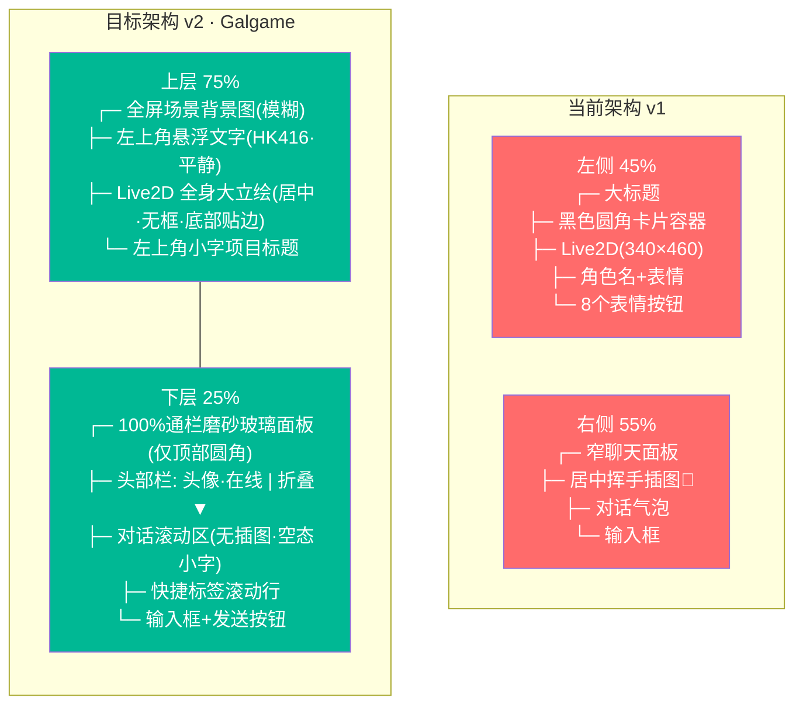
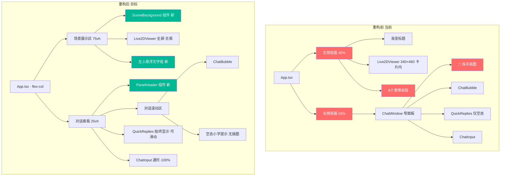

# UI 重构技术文档：经典视觉小说 (Galgame) 布局

> 项目：**心言 · MindChat** / 分支：`main` / 日期：2026-07-09
> 文档类型：**UI REFACTOR PLAN** / 状态：待评审
>
> 重构范围：从左右对半分栏 → 上下分层经典视觉小说布局

---

## 1. 现状诊断 vs 目标对比



---

## 2. 技术栈与选型理由

### 2.1 技术栈一览

| 层级 | 技术 | 版本 | 用途 |
|------|------|------|------|
| 构建 | Vite | ^8.1.1 | 极速 HMR，ESM 原生支持 |
| 框架 | React | ^19.2.7 | 组件化 UI 架构 |
| 类型 | TypeScript | ~6.0.2 | 类型安全 |
| 样式 | TailwindCSS | ^4.0.0 | Utility-First 原子化 CSS |
| 动画 | Framer Motion | ^12.42.2 | 声明式 React 动画 |
| 渲染 | PixiJS | ^6.5.10 | Live2D 2D 渲染引擎 |
| 模型 | pixi-live2d-display | ^0.4.0 | Live2D Cubism 2.1 驱动 |
| 状态 | Zustand | ^5.0.0 | 轻量全局状态管理 |

### 2.2 技术选型理由

**TailwindCSS 4.0 + @tailwindcss/vite**

- 零配置文件，Vite 原生插件直接集成
- Utility-First：Galgame 布局定制化程度极高（模糊背景、磨砂玻璃、文字描边、阴影层级），需要用 `backdrop-filter`、`text-shadow`、`mix-blend` 等大量原子类拼装，TailwindCSS 的任意值语法（`h-[75vh]`、`bg-black/40`）比手写 CSS 快 3-5 倍
- `@tailwindcss/vite` 去掉了 PostCSS 中间层，构建速度更快

**Framer Motion**

- 声明式 `motion.div` 语法天然适合 UI 入场/退场动画
- `AnimatePresence` 处理对话气泡的进出场，比 CSS transition 更可控
- `whileHover`/`whileTap` 微交互无需额外 JS 逻辑
- 对话面板折叠/展开的弹性动画只需 `layout` prop 即可实现

**PixiJS 6 + pixi-live2d-display 0.4**

- 项目已使用且验证通过，不做技术栈变更
- 本次不涉及 3D，PixiJS 的 WebGL 2D 渲染是最轻解决方案
- 0.4.0 版本稳定支持 Cubism 2.1 模型

**Zustand**

- 对话状态、表达式状态已在全局 store 中管理
- 本次重构不改变数据流，仅改变 UI 组件的消费方式和布局

### 2.3 不做引入的技术

| 不考虑 | 理由 |
|--------|------|
| TailwindCSS v3 + PostCSS | v4 已用 `@tailwindcss/vite`，不倒退 |
| styled-components / CSS Modules | TailwindCSS 已覆盖全部需求，引入额外工具增加依赖体积 |
| Three.js / React Three Fiber | 暂时不需要 3D 场景，PixiJS 足够 |
| 任何 UI 组件库(shadcn/ui 等) | Galgame 风格高度定制，组件库的预设样式是负担 |

---

## 3. 设计系统规范

### 3.1 色彩变量

```css
:root {
  --bg-deep:       #0A0A1A;   /* 最深底色（fallback） */
  --panel-glass:   rgba(10, 10, 26, 0.72);  /* 磨砂面板底色 */
  --panel-blur:    20px;       /* 磨砂模糊半径 */
  --text-primary:  #FFFFFF;    /* 主文字 · 纯白 */
  --text-secondary: rgba(255,255,255,0.55); /* 次要文字 · 浅灰 */
  --text-muted:    rgba(255,255,255,0.18);  /* 弱化文字 · 极浅灰 */
  --accent-purple: #7C5CFC;    /* 主题紫 · 交互强调 */
  --accent-pink:   #FF6B9D;    /* 辅助粉 · 渐变/点缀 */
  --online-green:  #4ADE80;    /* 在线状态绿点 */
  --bubble-ai:     rgba(255,255,255,0.06);  /* AI 气泡底色 */
  --bubble-user:   rgba(124,92,252,0.28);   /* 用户气泡底色 */
  --text-stroke:   rgba(0,0,0,0.55);        /* 悬浮文字描边 */
}
```

### 3.2 间距系统

| 令牌 | 值 | 用途 |
|------|-----|------|
| `page-pad-x` | 24px | 页面左右内边距 |
| `page-pad-top` | 16px | 页面顶部内边距 |
| `panel-pad-x` | 20px | 面板左右内边距 |
| `panel-pad-y` | 10~12px | 面板上下内边距 |
| `msg-gap` | 10px | 消息气泡间距 |
| `section-gap` | 10~12px | 面板子区域间距 |

### 3.3 字体规格

| 元素 | 字号 | 字重 | 颜色 |
|------|------|------|------|
| 角色名 H1 | 18px | 700 | `#FFF` + 黑色描边 |
| 状态标签 | 14px | 300 | `rgba(255,255,255,0.55)` |
| 项目标题 | 12px | 300 | `rgba(255,255,255,0.12)` |
| 对话正文 | 14px | 400 | `rgba(255,255,255,0.82)` |
| 头部栏文字 | 14px | 400 | `rgba(255,255,255,0.60)` |
| 空态提示 | 13px | 300 | `rgba(255,255,255,0.28)` |
| 快捷标签 | 12px | 400 | `rgba(255,255,255,0.55)` |
| 时间戳 | 10px | 300 | `rgba(255,255,255,0.18)` |

### 3.4 阴影层级 (z-index)

```
z-0   →  场景背景图
z-10  →  Live2D 画布
z-20  →  左上角悬浮文字
z-30  →  底部对话面板
z-40  →  面板内折叠下拉菜单
```

---

## 4. 组件树重构

### 4.1 重构前后对比



### 4.2 新增组件

| 组件 | 文件路径 | 职责 |
|------|----------|------|
| `SceneBackground` | `src/components/scene/SceneBackground.tsx` | 全屏场景背景图 + 高斯模糊 + 饱和度降低 |
| `CharacterOverlay` | `src/components/scene/CharacterOverlay.tsx` | 左上角角色状态文字（HK416·情绪） |
| `ProjectCredit` | `src/components/scene/ProjectCredit.tsx` | 左上角极小项目标题 |
| `PanelHeader` | `src/components/chat/PanelHeader.tsx` | 头部栏：头像+在线+折叠按钮 |

### 4.3 修改现有组件

| 组件 | 修改程度 | 说明 |
|------|----------|------|
| `App.tsx` | 重写 | `flex` → `flex-col`，移除左右分栏、表情按钮、卡片容器 |
| `Live2DViewer.tsx` | 中度 | 移除 backgroundColor 固定值改为透明，尺寸匹配上层容器 |
| `ChatWindow.tsx` | 重写 | 拆分成 PanelHeader + 滚动区 + QuickReplies + ChatInput 扁平结构 |
| `ChatBubble.tsx` | 轻度 | 气泡宽度 85%，调整颜色变量，移除角色名行 |
| `ChatInput.tsx` | 中度 | 通栏 100% 宽，外框包裹输入框+发送按钮 |
| `QuickReplies.tsx` | 中度 | 始终显示（非仅空态），横向滑动，样式升级 |
| `index.css` | 中度 | 新增磨砂面板专用类 `.glass-panel`，文字描边 mixin |

### 4.4 删除项

| 组件/代码 | 原因 |
|-----------|------|
| `AmbientParticles` (App.tsx 内的粒子背景) | 替换为场景背景图 |
| `GlowBackground` (App.tsx 内的底部光晕) | 不符合 Galgame 视觉风格 |
| 表情选择器按钮组 (App.tsx lines 126-148) | 需求明确：仅靠 AI 对话驱动 |
| Live2D 卡片容器 `glass` + `w-[340px] h-[460px]` | 移除人物外框 |
| 角色名+表情文字组 (App.tsx lines 113-123) | 迁移到左上悬浮层 |
| 挥手插图 + "开始聊天"空态 (ChatWindow lines 46-63) | 替换为纯文字空态 |
| "清空对话"按钮 (ChatWindow line 32-37) | 迁移至折叠下拉菜单 |
| 底部技术信息行 (App.tsx lines 164-173) | 移除，无 Galgame 场景价值 |

---

## 5. 关键实现细节

### 5.1 场景背景图

```tsx
// 新增组件: src/components/scene/SceneBackground.tsx
// 核心技术: CSS filter + backdrop-blur
<div
  className="absolute inset-0 z-0"
  style={{
    backgroundImage: `url(${bgImage})`,
    backgroundSize: 'cover',
    backgroundPosition: 'center',
    filter: 'blur(4px) saturate(0.7)',  // 高斯模糊 + 降饱和度
  }}
>
  {/* 叠加暗色遮罩，增强文字可读性 */}
  <div className="absolute inset-0 bg-black/25" />
</div>
```

**为什么不用 Canvas/PixiJS 渲染背景**：背景是静态 JPEG/PNG 图片，CSS `background-image` 零 JS 开销，GPU 加速的 `filter` 和 `backdrop-filter` 性能远高于在 PixiJS 中创建额外的 Sprite + BlurFilter。场景图不参与 Live2D 模型渲染管线。

**背景替换 API**：暴露一个 `sceneSrc` prop，用户可通过配置切换（街道→室内→夜景），留空时 fallback 到纯色 `#0A0A1A`。

### 5.2 Live2D 立绘放大与无框化

当前 canvas 尺寸硬编码为 340×460，且 PIXI.Application 初始化为该尺寸。

```typescript
// 重构后的 Live2DViewer 尺寸策略
const w = container.clientWidth;   // 等于上层场景区 100% 宽度
const h = container.clientHeight;  // 等于上层场景区 100% 高度

// PIXI.Application 背景透明
app.renderer.backgroundColor = 0x000000;
app.renderer.view.style.backgroundColor = 'transparent';

// 模型缩放：放大至占上层 60% 高度
const targetH = container.clientHeight * 0.6;  // 人物占上层 60%
const scale = Math.min(targetH / modelH, (container.clientWidth * 0.5) / modelW);
model.scale.set(scale * 1.15);  // 微调放大系数
model.y = container.clientHeight * 0.65;  // 下半段定位
model.anchor.set(0.5, 0.5);
```

Canvas 容器本身不再包裹 `.glass` 卡片，直接 `<canvas className="w-full h-full absolute inset-0 z-10" />`。

### 5.3 左上角悬浮文字描边

CSS `text-shadow` 实现描边跨浏览器最可靠：

```css
.text-stroke {
  text-shadow:
    -1px -1px 0 rgba(0,0,0,0.55),
     1px -1px 0 rgba(0,0,0,0.55),
    -1px  1px 0 rgba(0,0,0,0.55),
     1px  1px 0 rgba(0,0,0,0.55);
}
```

TailwindCSS 4 不原生支持 `text-shadow`，需在 `index.css` 中新增 `@utility text-stroke`。

### 5.4 底部对话面板磨砂玻璃

```css
/* 仅顶部圆角 + 底部贴合浏览器底边 */
.glass-panel {
  background: rgba(10, 10, 26, 0.72);
  backdrop-filter: blur(20px) saturate(1.2);
  -webkit-backdrop-filter: blur(20px) saturate(1.2);
  border-top: 1px solid rgba(255, 255, 255, 0.08);
  border-radius: 20px 20px 0 0;  /* 仅顶部两角 */
}
```

**为什么不用 border 四面**：底部贴合浏览器底边，border-bottom 会导致底部出现视觉缝隙。

### 5.5 面板折叠/展开动画 (Framer Motion)

```tsx
// 核心: 面板高度在两个值间弹性切换
<motion.div
  animate={{ height: collapsed ? 56 : '25vh' }}
  transition={{ type: 'spring', stiffness: 300, damping: 30 }}
>
```

折叠态仅显示头部栏（36px + 上下 padding），展开态为完整 25vh。折叠按钮内嵌在 `PanelHeader` 右侧，点击切换 `collapsed` 状态。

折叠态时，上方 Live2D 场景区自动扩展到 100vh - 56px。

### 5.6 空态文字提示

```
替换前: 👋 + "和 Haru 开始聊天吧～" + "你的专属 AI 虚拟伴侣"
替换后: "发送消息开启对话"  (纯文字，浅灰色，居中，无任何 emoji 或插图)
```

### 5.7 快捷标签始终显示 + 横向滑动

```tsx
// QuickReplies 改造
<div className="overflow-x-auto scrollbar-none whitespace-nowrap px-[20px]">
  <div className="flex gap-2">
    {/* 标签列表 */}
  </div>
</div>
```

移除 `messages.length === 0` 的条件渲染。`scrollbar-none` 隐藏滚动条但保留触摸滑动。

### 5.8 清空对话迁移至下拉菜单

```tsx
// PanelHeader 右侧新增三点下拉
<button onClick={() => setMenuOpen(!menuOpen)} className="...">⋮</button>
{menuOpen && (
  <div className="absolute right-0 bottom-full mb-2 ...">
    <button onClick={clearMessages}>清空对话</button>
  </div>
)}
```

无 hover 触发的清空操作（降低误触），替代原 ChatWindow 顶部栏右侧独立按钮。

---

## 6. 实施计划

### Phase 1：场景展示区重构 (1.5h)

| 步骤 | 内容 | 文件 |
|------|------|------|
| 1.1 | 新增 `SceneBackground.tsx` | 新文件 |
| 1.2 | 新增 `CharacterOverlay.tsx` | 新文件 |
| 1.3 | 新增 `ProjectCredit.tsx` | 新文件 |
| 1.4 | 修改 `Live2DViewer.tsx`：透明背景 + 自适应尺寸 + 放大立绘 | 修改 |
| 1.5 | 修改 `App.tsx`：`flex`→`flex-col`，场景区占 75vh | 修改 |

### Phase 2：对话面板重构 (2h)

| 步骤 | 内容 | 文件 |
|------|------|------|
| 2.1 | 新增 `PanelHeader.tsx`（头像+在线+折叠+三点菜单） | 新文件 |
| 2.2 | 重写 `ChatWindow.tsx`：扁平化为 PanelHeader+滚动区+QuickReplies+ChatInput | 修改 |
| 2.3 | 修改 `ChatInput.tsx`：通栏 100% 宽，外框包裹 | 修改 |
| 2.4 | 修改 `ChatBubble.tsx`：气泡 85% 宽，新颜色变量，移除角色名行 | 修改 |
| 2.5 | 修改 `QuickReplies.tsx`：始终显示+横向滑动+新样式 | 修改 |

### Phase 3：全局删除 + CSS 补全 (0.5h)

| 步骤 | 内容 | 文件 |
|------|------|------|
| 3.1 | 删除 App.tsx 中：AmbientParticles、GlowBackground、表情按钮、底部信息行 | 修改 |
| 3.2 | `index.css`：新增 `.glass-panel`、`text-stroke` utility | 修改 |
| 3.3 | 删除 ChatWindow 中：空态挥手插图、"清空对话"按钮 | 修改 |

### Phase 4：集成测试 (0.5h)

| 编号 | 测试场景 | 预期 |
|------|----------|------|
| T1 | 页面加载 | 场景背景 + Live2D 居中大立绘 + 左上悬浮文字 + 底部面板 |
| T2 | 窗口缩放 | 立绘等比例缩放，面板始终 100% 宽 |
| T3 | 发送消息 | 气泡左/右对齐，自动滚动，无挥手插图 |
| T4 | 面板折叠 | 展开/收起动画流畅，展开态不遮挡立绘 |
| T5 | 清空对话(下拉菜单) | 消息全部清除，恢复空态小字 |
| T6 | 快捷标签滑动 | 手机端触摸横向滑动正常 |
| T7 | 表情按钮 | 确认已完全移除，无残留 |

---

## 7. 文件变更汇总

| # | 文件 | 操作 | 复杂度 |
|---|------|------|--------|
| 1 | `src/App.tsx` | **重写** | 高 |
| 2 | `src/components/Live2D/Live2DViewer.tsx` | **修改** | 中 |
| 3 | `src/components/chat/ChatWindow.tsx` | **重写** | 高 |
| 4 | `src/components/chat/ChatInput.tsx` | **修改** | 中 |
| 5 | `src/components/chat/ChatBubble.tsx` | **修改** | 低 |
| 6 | `src/components/chat/QuickReplies.tsx` | **修改** | 中 |
| 7 | `src/components/scene/SceneBackground.tsx` | **新增** | 中 |
| 8 | `src/components/scene/CharacterOverlay.tsx` | **新增** | 低 |
| 9 | `src/components/scene/ProjectCredit.tsx` | **新增** | 低 |
| 10 | `src/components/chat/PanelHeader.tsx` | **新增** | 中 |
| 11 | `src/index.css` | **修改** | 低 |

**总计：4 新增 + 3 重写 + 4 修改 = 11 文件**

### 本次不改动的文件

| 文件 | 保留原因 |
|------|----------|
| `src/types/index.ts` | `ExpressionType` 等类型不变 |
| `src/store/chatStore.ts` | 状态管理逻辑不变，仅 UI 消费层变化 |
| `src/services/ai.ts` | AI 流式对话逻辑不变 |
| `src/data/expressions.ts` | 表情数据定义不变（UI 移除按钮但数据保留供 AI 驱动） |
| `src/data/characters.ts` | 角色配置不变 |
| `public/models/*` | 模型文件不变 |
| `public/live2d.min.js` | 运行时不变 |
| `package.json` | 依赖不变 |

---

## 8. 风险与注意事项

| 风险 | 概率 | 影响 | 规避 |
|------|------|------|------|
| PIXI canvas 透明背景导致 Live2D 渲染异常 | 中 | 立绘不可见或黑底 | 保留 `backgroundColor: 0x0A0A1A` 作为 fallback，确认 model alpha 通道正常 |
| `backdrop-filter` 在旧版浏览器不支持 | 低 | 面板无磨砂效果 | 降级为纯 `rgba` 半透明背景，不影响功能性 |
| 折叠面板动画与对话滚动冲突 | 中 | 动画卡顿 | Framer Motion `layout` 动画使用 `type: 'spring'` 而非 `tween` |
| 快捷标签横向滑动在桌面端无触控板体验差 | 低 | 部分用户无法滚动 | 同时支持鼠标滚轮横向滚动（`onWheel` 事件劫持） |
| 场景背景图加载慢导致闪烁 | 低 | 首屏白底闪现 | 预置纯色背景 fallback，图片 `onLoad` 后淡入过渡 |

---

## 9. 架构总览图

```
App.tsx (flex-col, h-screen)
├── SceneArea (h-[75vh], relative, overflow-hidden)
│   ├── SceneBackground (absolute, inset-0, z-0)
│   │   ├──  场景图 (CSS filter: blur + saturate)
│   │   └── 暗色遮罩层 (bg-black/25)
│   ├── Live2DViewer (absolute, inset-0, z-10)
│   │   └── <canvas> (PixiJS, 透明背景, 自适应父容器)
│   ├── CharacterOverlay (absolute, top-4, left-6, z-20)
│   │   ├── 角色名: "HK416" (18px, bold, text-stroke)
│   │   └── 状态: "● 平静" (14px, light gray)
│   └── ProjectCredit (absolute, top-2, left-6, z-20)
│       └── "心言 · MindChat Live2D AI Companion" (12px, 极低透明度)
│
└── ChatPanel (w-full, z-30, glass-panel, rounded-t-[20px])
    ├── PanelHeader (h-[36px], px-[20px], flex, justify-between)
    │   ├── 头像+名称+在线 (flex, items-center, gap-2)
    │   └── [⋮ 下拉菜单 / ▼ 折叠]
    ├── ScrollArea (flex-1, overflow-y-auto, px-[20px])
    │   ├── 空态: "发送消息开启对话" (居中, 浅灰, text-13px)
    │   └── ChatBubble[] (AI左/用户右, max-w-[85%])
    ├── QuickReplies (overflow-x-auto, whitespace-nowrap, px-[20px])
    │   └── [你好呀] [今天心情不错] [有点无聊] [讲个笑话] [晚安] [你是谁]
    └── ChatInput (flex, px-[20px], py-[10px], border rounded)
        ├── <textarea> "说点什么吧…"
        └── <button> ▶ 发送
```
